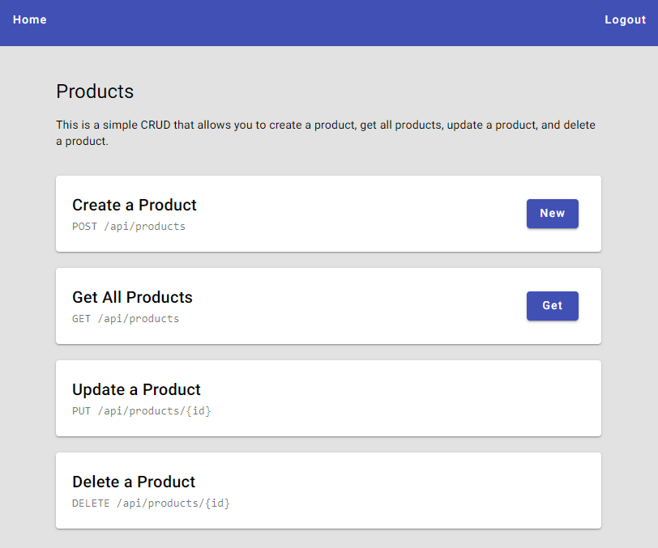

<div align='center'>

  [![demo][demo]][demo-link]
  [![status][status]][status-link]
  [![test][tests]][tests-link]

</div>

<div align='center'>
  <a href='/'>
    
  </a>
</div>

<div align='center'>
  <h1>REST API with Express and TypeScript</h1>
</div>

<div align='center'>

  [![TypeScript][typescript]][typescript-link]
  [![Express][express]][express-link]
  [![Node.js][nodejs]][nodejs-link]
  [![MongoDB][mongodb]][mongodb-link]
  [![Mongoose][mongoose]][mongoose-link]
  [![Angular][angular]][angular-link]
  [![Angular Material][angular-material]][angular-material-link]

</div>

<div align='center'>
  REST API built with Express and TypeScript featuring user authentication, product CRUD operations, and an Angular 17 frontend with Angular Material. Uses MongoDB for data persistence.

  [Demo]({{DEMO_URL}}) · [Report issue](/issues) · [Suggest something](/issues)
</div>

## Table of Contents

- [Table of Contents](#table-of-contents)
- [Features](#features)
- [Tech Stack](#tech-stack)
- [Getting Started](#getting-started)
  - [Prerequisites](#prerequisites)
  - [Installation](#installation)
  - [Running locally](#running-locally)
  - [Build](#build)
- [Environment Variables](#environment-variables)
- [Project Structure](#project-structure)
- [Demo](#demo)
- [API Reference](#api-reference)
- [Contributing](#contributing)
- [License](#license)

## Features

- [x] User registration and login with session token authentication
- [x] Password hashing with HMAC SHA-256 and random salt
- [x] Session token stored in cookies for authentication
- [x] CRUD operations for products (create, read, update, delete)
- [x] CRUD operations for users (read, update, delete)
- [x] Ownership middleware to protect product modifications
- [x] Authentication middleware for protected routes
- [x] Angular 17 standalone frontend with Angular Material UI
- [x] Auth guard and HTTP interceptor for frontend authentication
- [x] Reactive forms for product management
- [x] MongoDB with Mongoose ODM
- [x] TypeScript on both backend and frontend
- [x] Hot reload with Nodemon during development

## Tech Stack

- [TypeScript](https://www.typescriptlang.org/)
- [Express](https://expressjs.com/)
- [Node.js](https://nodejs.org/)
- [MongoDB](https://www.mongodb.com/)
- [Mongoose](https://mongoosejs.com/)
- [Angular 17](https://angular.io/)
- [Angular Material](https://material.angular.io/)
- [Lodash](https://lodash.com/)
- [Dotenv](https://www.npmjs.com/package/dotenv)

## Getting Started

### Prerequisites

- Node.js 18+
- npm
- A MongoDB instance (local or MongoDB Atlas)

### Installation

```bash
git clone https://github.com/wrujel/rest-api-et.git
cd rest-api-et
npm install
cd frontend/angular
npm install
cd ../..
```

### Running locally

```bash
npm run dev
```

Open [http://localhost:8080](http://localhost:8080) with your browser to see the result.

### Build

```bash
npm run build
```

## Environment Variables

To run this project, you will need to add the following environment variables to your `.env` file.

| Variable              | Description                                                                          | Required |
| :-------------------- | :----------------------------------------------------------------------------------- | :------: |
| `MONGO_URL`           | MongoDB connection string                                                            |   Yes    |
| `SECRET`              | Secret key used for HMAC password hashing                                            |   Yes    |
| `PORT`                | Server port (defaults to 8080)                                                       |    No    |
| `FRONTEND_BUILD_PATH` | Path to the Angular frontend build output                                            |    No    |
| `ENVIRONMENT`         | Set to `development` to enable session token in login response and header-based auth |    No    |

## Project Structure

```
/
├── public/
│   └── screenshot.png
├── src/
│   ├── controllers/
│   │   ├── authentication.ts
│   │   ├── products.ts
│   │   └── users.ts
│   ├── db/
│   │   ├── product.ts
│   │   └── users.ts
│   ├── helpers/
│   │   └── index.ts
│   ├── middlewares/
│   │   └── index.ts
│   ├── router/
│   │   ├── authentication.ts
│   │   ├── index.ts
│   │   ├── products.ts
│   │   └── users.ts
│   └── index.ts
├── frontend/
│   └── angular/
│       └── src/
│           └── app/
│               ├── components/
│               │   ├── api-card/
│               │   ├── home/
│               │   ├── login/
│               │   ├── navbar/
│               │   └── register/
│               ├── models/
│               ├── services/
│               └── app.routes.ts
├── package.json
├── tsconfig.json
└── nodemon.json
```

## Demo

You can check out the demo:

[![Demo][demo]][demo-link]

## API Reference

| Method   | Endpoint             | Description                           | Auth Required |
| :------- | :------------------- | :------------------------------------ | :-----------: |
| `POST`   | `/api/auth/register` | Register a new user                   |      No       |
| `POST`   | `/api/auth/login`    | Login and get session token           |      No       |
| `GET`    | `/api/users`         | List all users                        |      Yes      |
| `DELETE` | `/api/users/:id`     | Delete a user by ID                   |  Yes (Owner)  |
| `PATCH`  | `/api/users/:id`     | Update a user's username              |  Yes (Owner)  |
| `GET`    | `/api/products`      | List all products                     |      Yes      |
| `POST`   | `/api/products`      | Create a new product                  |      Yes      |
| `PUT`    | `/api/products`      | Update a product (id via query param) |  Yes (Owner)  |
| `DELETE` | `/api/products`      | Delete a product (id via query param) |  Yes (Owner)  |

## Contributing

Contributions are welcome! If you have suggestions or find bugs, please open an issue or submit a pull request.

1. Fork the repository
2. Create your feature branch (`git checkout -b feature/amazing-feature`)
3. Commit your changes (`git commit -m 'Add some amazing feature'`)
4. Push to the branch (`git push origin feature/amazing-feature`)
5. Open a Pull Request

## License

This project is licensed under the [MIT License](LICENSE).

---

<!-- Badges -->
[typescript]: https://img.shields.io/badge/Typescript-007ACC?style=for-the-badge&logo=typescript&logoColor=white&color=blue
[express]: https://img.shields.io/badge/Express%20js-000000?style=for-the-badge&logo=express&logoColor=white
[nodejs]: https://img.shields.io/badge/Node.js-339933?style=for-the-badge&logo=node.js&logoColor=white
[mongodb]: https://img.shields.io/badge/MongoDB-47A248?style=for-the-badge&logo=mongodb&logoColor=white
[mongoose]: https://img.shields.io/badge/Mongoose-2A2A2A?style=for-the-badge&logo=mongoose&logoColor=white
[angular]: https://img.shields.io/badge/Angular-DD0031?style=for-the-badge&logo=angular&logoColor=white
[angular-material]: https://img.shields.io/badge/Angular%20Material-DD0031?style=for-the-badge&logo=angular&logoColor=white

<!-- Badge links -->
[typescript-link]: https://www.typescriptlang.org/
[express-link]: https://expressjs.com/
[nodejs-link]: https://nodejs.org/
[mongodb-link]: https://www.mongodb.com/
[mongoose-link]: https://mongoosejs.com/
[angular-link]: https://angular.dev/
[angular-material-link]: https://material.angular.dev/

<!-- Status badges -->
[demo]: https://img.shields.io/badge/🚀%20Live%20Demo-Click%20Here-blue?style=for-the-badge
[demo-link]: https://rest-api-et.onrender.com
[status]: https://img.shields.io/endpoint?url=https%3A%2F%2Fraw.githubusercontent.com%2Fwrujel%2Fmonitor-repos%2Fmain%2Fdata%2Frest-api-et.json
[status-link]: https://github.com/wrujel/monitor-repos
[tests]: https://img.shields.io/endpoint?url=https%3A%2F%2Fraw.githubusercontent.com%2Fwrujel%2Fmonitor-tests%2Fmain%2Fdata%2Frest-api-et.json
[tests-link]: https://github.com/wrujel/monitor-tests
