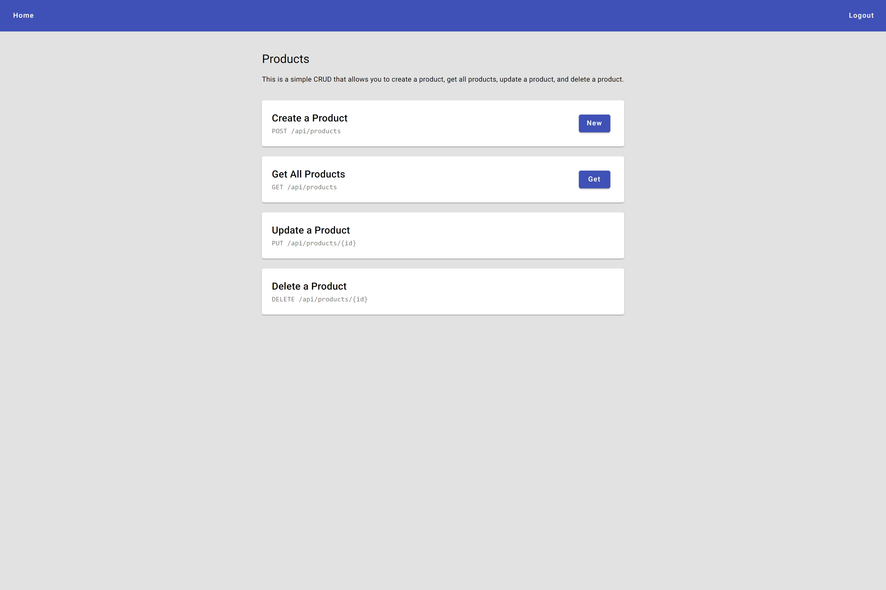

<div align='center'>

[![demo][demo]][demo-link]
[![status][status]][status-link]
[![test][tests]][tests-link]

</div>

<div align='center'>
  <a href='/'>
    
  </a>
</div>

<div align='center'>
  <h1>REST API with Express and TypeScript</h1>
</div>

<div align='center'>

[![TypeScript][typescript]][typescript-link]
[![Express][express]][express-link]
[![Node.js][nodejs]][nodejs-link]
[![MongoDB][mongodb]][mongodb-link]
[![Mongoose][mongoose]][mongoose-link]
[![JWT][jwt]][jwt-link]
[![Passport][passport]][passport-link]
[![Angular][angular]][angular-link]
[![Angular Material][angular-material]][angular-material-link]
[![GSAP][gsap]][gsap-link]

</div>

<div align='center'>
  A REST API built with Express and TypeScript, featuring argon2id password hashing, 15-minute JWT access tokens with rotating refresh cookies, GitHub and Google OAuth, rate-limited credential endpoints, and product CRUD guarded by authentication and ownership middleware. Legacy HMAC accounts re-hash transparently on their next login. Ships with an Angular 20 dashboard that documents every endpoint, searches them from a sidebar and calls them live.

[Demo][demo-link] · [Report issue](/issues) · [Suggest something](/issues)

</div>

## Table of Contents

- [Table of Contents](#table-of-contents)
- [Features](#features)
- [Tech Stack](#tech-stack)
- [Getting Started](#getting-started)
  - [Prerequisites](#prerequisites)
  - [Installation](#installation)
  - [Running locally](#running-locally)
  - [Build](#build)
- [Environment Variables](#environment-variables)
- [Project Structure](#project-structure)
- [Demo](#demo)
- [API Reference](#api-reference)
- [Contributing](#contributing)
- [License](#license)

## Features

- [x] User registration and login with argon2id password hashing
- [x] JWT access tokens (15 min) plus rotating refresh tokens stored in an httpOnly cookie (7 days)
- [x] Legacy HMAC-SHA256 accounts transparently re-hashed to argon2 on their next login
- [x] OAuth sign-in with GitHub and Google, auto-enabled when provider credentials are present
- [x] Rate limiting on the credential and refresh endpoints
- [x] CRUD operations for products (create, read, update, delete)
- [x] User listing, update and delete endpoints
- [x] Authentication and ownership middlewares protecting the mutating routes
- [x] gzip compression, credentialed CORS and SPA fallback routing from the API server
- [x] Interactive API docs dashboard — deep-linkable endpoints, sidebar search, syntax-highlighted samples and a live "try it" dialog
- [x] Angular 20 standalone frontend with Angular Material
- [x] Auth guard plus auth and error HTTP interceptors
- [x] WebGL aurora background (OGL) and GSAP-driven reveal, tilt, magnetic and count-up directives
- [x] Password strength meter powered by zxcvbn
- [x] Persisted light/dark theme
- [x] Reactive forms for product management
- [x] MongoDB with Mongoose ODM
- [x] TypeScript on both backend and frontend
- [x] Unit tests with Karma and Jasmine
- [x] Hot reload with Nodemon during development

## Tech Stack

- [TypeScript](https://www.typescriptlang.org/)
- [Express](https://expressjs.com/)
- [Node.js](https://nodejs.org/)
- [MongoDB](https://www.mongodb.com/)
- [Mongoose](https://mongoosejs.com/)
- [argon2](https://www.npmjs.com/package/argon2)
- [jsonwebtoken](https://www.npmjs.com/package/jsonwebtoken)
- [Passport](https://www.passportjs.org/)
- [express-rate-limit](https://express-rate-limit.mintlify.app/overview)
- [Lodash](https://lodash.com/)
- [Dotenv](https://www.npmjs.com/package/dotenv)
- [Angular 20](https://angular.dev/)
- [Angular Material](https://material.angular.dev/)
- [GSAP](https://gsap.com/)
- [OGL](https://github.com/oframe/ogl)
- [zxcvbn-ts](https://zxcvbn-ts.github.io/zxcvbn/)

## Getting Started

### Prerequisites

- Node.js 20.19+ (the repo pins 22.19.0 via `.node-version`)
- npm
- A MongoDB instance (local or MongoDB Atlas)
- Optional: GitHub and/or Google OAuth credentials to enable social sign-in

### Installation

```bash
git clone https://github.com/wrujel/rest-api-et.git
cd rest-api-et
npm install
npm --prefix frontend/angular install
```

### Running locally

Run the API and the Angular watcher together:

```bash
npm run dev:all
```

Or run just the API with hot reload:

```bash
npm run dev
```

Open [http://localhost:8080](http://localhost:8080) with your browser to see the result.

### Build

```bash
npm run build
```

| Command             | Action                                                       |
| :------------------ | :----------------------------------------------------------- |
| `npm install`       | Installs backend dependencies                                |
| `npm run dev`       | Starts the API with Nodemon at `localhost:8080`              |
| `npm run watch:ui`  | Rebuilds the Angular frontend on change                      |
| `npm run dev:all`   | Runs the API and the Angular watcher concurrently            |
| `npm run build`     | Compiles the TypeScript backend to `./dist/`                 |
| `npm run start`     | Runs the API from source with `ts-node`                      |
| `npm run start-dev` | Builds the Angular frontend, then serves the compiled server |

## Environment Variables

To run this project, you will need to add the following environment variables to your `.env` file.

| Variable               | Description                                                                     | Required |
| :--------------------- | :------------------------------------------------------------------------------ | :------: |
| `MONGO_URL`            | MongoDB connection string                                                       |   Yes    |
| `FRONTEND_BUILD_PATH`  | Path to the Angular frontend build output served as static files                |   Yes    |
| `JWT_ACCESS_SECRET`    | Signing secret for short-lived access tokens                                    |   Yes    |
| `JWT_REFRESH_SECRET`   | Signing secret for refresh tokens                                               |   Yes    |
| `PORT`                 | Server port (defaults to 8080)                                                  |    No    |
| `ENVIRONMENT`          | Set to `production` to mark the refresh cookie as `Secure`                      |    No    |
| `CORS_ORIGIN`          | Allowed CORS origin (defaults to reflecting the request origin)                 |    No    |
| `API_PUBLIC_URL`       | Public base URL used to build OAuth callbacks (default `http://localhost:8080`) |    No    |
| `GITHUB_CLIENT_ID`     | GitHub OAuth app client ID — enables GitHub sign-in when set with its secret    |    No    |
| `GITHUB_CLIENT_SECRET` | GitHub OAuth app client secret                                                  |    No    |
| `GOOGLE_CLIENT_ID`     | Google OAuth client ID — enables Google sign-in when set with its secret        |    No    |
| `GOOGLE_CLIENT_SECRET` | Google OAuth client secret                                                      |    No    |
| `SECRET`               | Legacy HMAC pepper, only needed to migrate pre-JWT accounts on login            |    No    |

## Project Structure

```
/
├── public/
│   └── screenshot.png
├── src/
│   ├── controllers/
│   │   ├── authentication.ts
│   │   ├── oauth.ts
│   │   ├── products.ts
│   │   └── users.ts
│   ├── db/
│   │   ├── product.ts
│   │   └── users.ts
│   ├── helpers/
│   │   └── index.ts
│   ├── middlewares/
│   │   └── index.ts
│   ├── router/
│   │   ├── authentication.ts
│   │   ├── index.ts
│   │   ├── products.ts
│   │   └── users.ts
│   └── index.ts
├── frontend/
│   └── angular/
│       └── src/
│           ├── app/
│           │   ├── components/
│           │   │   ├── api-docs/
│           │   │   ├── api-test-dialog/
│           │   │   ├── aurora-background/
│           │   │   ├── auth-callback/
│           │   │   ├── confirm-dialog/
│           │   │   ├── home/
│           │   │   ├── login/
│           │   │   ├── navbar/
│           │   │   ├── not-found/
│           │   │   ├── product-form-dialog/
│           │   │   ├── register/
│           │   │   └── social-login/
│           │   ├── directives/
│           │   ├── models/
│           │   ├── services/
│           │   ├── utils/
│           │   └── app.routes.ts
│           ├── environments/
│           └── styles/
├── package.json
├── tsconfig.json
├── .node-version
└── nodemon.json
```

## Demo

You can check out the demo:

[![Demo][demo]][demo-link]

## API Reference

| Method   | Endpoint                    | Description                             | Auth Required  |
| :------- | :-------------------------- | :-------------------------------------- | :------------: |
| `GET`    | `/api`                      | API name, version and author            |       No       |
| `POST`   | `/api/auth/register`        | Register a new user                     |       No       |
| `POST`   | `/api/auth/login`           | Login and receive an access token       |       No       |
| `POST`   | `/api/auth/refresh`         | Exchange the refresh cookie for a token | Refresh cookie |
| `POST`   | `/api/auth/logout`          | Revoke the refresh token and clear it   |       No       |
| `GET`    | `/api/auth/providers`       | Which OAuth providers are configured    |       No       |
| `GET`    | `/api/auth/github`          | Start GitHub OAuth sign-in              |       No       |
| `GET`    | `/api/auth/github/callback` | GitHub OAuth callback                   |       No       |
| `GET`    | `/api/auth/google`          | Start Google OAuth sign-in              |       No       |
| `GET`    | `/api/auth/google/callback` | Google OAuth callback                   |       No       |
| `GET`    | `/api/users`                | List all users                          |      Yes       |
| `PATCH`  | `/api/users/:id`            | Update a user's username                |  Yes (Owner)   |
| `DELETE` | `/api/users/:id`            | Delete a user by ID                     |  Yes (Owner)   |
| `GET`    | `/api/products`             | List all products                       |      Yes       |
| `POST`   | `/api/products`             | Create a new product                    |      Yes       |
| `PUT`    | `/api/products?id=`         | Update a product (id via query param)   |  Yes (Owner)   |
| `DELETE` | `/api/products?id=`         | Delete a product (id via query param)   |  Yes (Owner)   |

Protected endpoints expect an `Authorization: Bearer <accessToken>` header. The refresh
token is never exposed to JavaScript — it lives in an httpOnly cookie scoped to `/api/auth`.

## Contributing

Contributions are welcome! If you have suggestions or find bugs, please open an issue or submit a pull request.

1. Fork the repository
2. Create your feature branch (`git checkout -b feature/amazing-feature`)
3. Commit your changes (`git commit -m 'Add some amazing feature'`)
4. Push to the branch (`git push origin feature/amazing-feature`)
5. Open a Pull Request

## License

This project is licensed under the [MIT License](LICENSE).

---

<!-- Badges -->

[typescript]: https://img.shields.io/badge/Typescript-007ACC?style=for-the-badge&logo=typescript&logoColor=white&color=blue
[express]: https://img.shields.io/badge/Express%20js-000000?style=for-the-badge&logo=express&logoColor=white
[nodejs]: https://img.shields.io/badge/Node.js-339933?style=for-the-badge&logo=node.js&logoColor=white
[mongodb]: https://img.shields.io/badge/MongoDB-47A248?style=for-the-badge&logo=mongodb&logoColor=white
[mongoose]: https://img.shields.io/badge/Mongoose-2A2A2A?style=for-the-badge&logo=mongoose&logoColor=white
[jwt]: https://img.shields.io/badge/JWT-000000?style=for-the-badge&logo=jsonwebtokens&logoColor=white
[passport]: https://img.shields.io/badge/Passport-34E27A?style=for-the-badge&logo=passport&logoColor=white
[angular]: https://img.shields.io/badge/Angular-DD0031?style=for-the-badge&logo=angular&logoColor=white
[angular-material]: https://img.shields.io/badge/Angular%20Material-DD0031?style=for-the-badge&logo=angular&logoColor=white
[gsap]: https://img.shields.io/badge/GSAP-88CE02?style=for-the-badge&logo=greensock&logoColor=white

<!-- Badge links -->

[typescript-link]: https://www.typescriptlang.org/
[express-link]: https://expressjs.com/
[nodejs-link]: https://nodejs.org/
[mongodb-link]: https://www.mongodb.com/
[mongoose-link]: https://mongoosejs.com/
[jwt-link]: https://www.jwt.io/
[passport-link]: https://www.passportjs.org/
[angular-link]: https://angular.dev/
[angular-material-link]: https://material.angular.dev/
[gsap-link]: https://gsap.com/

<!-- Status/Demo badges -->

[demo]: https://img.shields.io/badge/🚀%20Live%20Demo-000000?style=for-the-badge&&logoColor=white&color=0a6bdb
[status-link]: https://github.com/wrujel/monitor-repos
[tests-link]: https://github.com/wrujel/monitor-tests
[demo-link]: https://rest-api-et.onrender.com
[status]: https://img.shields.io/endpoint?url=https%3A%2F%2Fraw.githubusercontent.com%2Fwrujel%2Fmonitor-repos%2Fmain%2Fdata%2Frest-api-et.json
[tests]: https://img.shields.io/endpoint?url=https%3A%2F%2Fraw.githubusercontent.com%2Fwrujel%2Fmonitor-tests%2Fmain%2Fdata%2Frest-api-et.json
